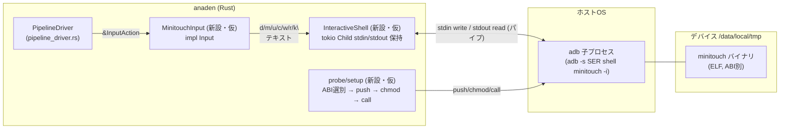
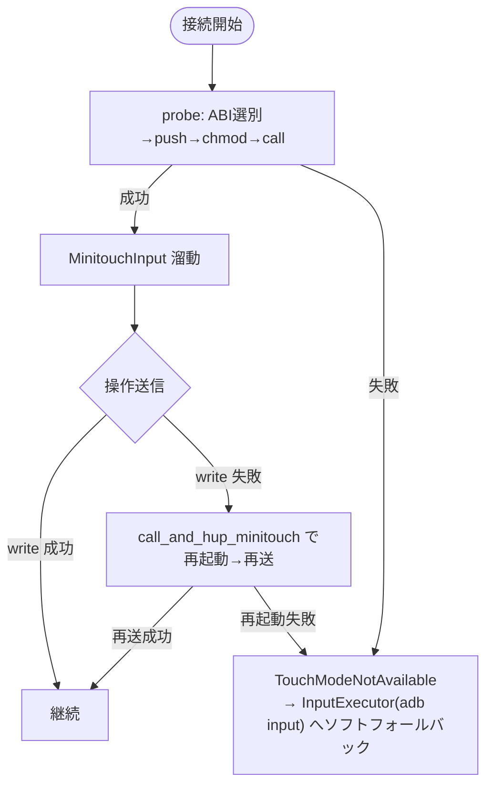

# anaden minitouch 導入設計書

> 本書は MAA (MaaAssistantArknights) ソース読み取り調査結果に基づく設計書である。
> 推測・Web 検索を含まず、末尾「MAA 参照」の `file:line` を根拠とする。
> 本書はコード実装を行わない。実装ステップは指針のみを示す。

関連: [[Performance]]（実測ベースライン）, [[MAA-Pipeline-System]], [[MAA-Resolution-Scaling]], [[Architecture]]

---

## 1. 目的と効果

### 1.1 現状の律速

[[Performance]] 4 節「律速対策」の実測より、anaden の 1 ループ E2E は
`capture + normalize + 認識 + tap` で構成され、その固定コストは:

| 工程 | 中央値(ms) | 全体比 | 根拠 |
|---|---|---|---|
| capture (adb exec-out screencap -p) | 797.26 | 約 86% | [[Performance]] §2 |
| **tap (adb shell input tap)** | **106.04** | **約 11%** | [[Performance]] §2 |
| normalize | 23.30 | — | [[Performance]] §2 |

固定コスト `capture + tap ≈ 903.30ms` がループ時間の大部分を占め、
現状の下限は「認識を 0ms にしても 903ms が床」である（[[Performance]] §3）。
推奨設定（ccoeff/roi/ds=2）で E2E 931ms と 1 秒仕様を達成するが、
capture 1 回分の揺らぎで超過し得る「ギリギリの状態」にある。

### 1.2 minitouch が削るもの

`adb shell input tap` は **毎回 adb プロセスを起動** するため 106ms かかる
（[[Performance]] §4「tap 高速化」）。
MAA の minitouch は「`adb shell minitouch -i` 子プロセスを 1 つ起動し、
その **stdin/stdout パイプ** を保持したままテキストコマンドを流し続ける」
方式を採る（調査 `minitouch_protocol` §1, §4, `maa_integration` interactive_shell）。
起動コストは 1 回限りで、以降の送信はパイプ write のみで数 ms となる。
これが `adb input`(106ms) との速度差の本質である。

### 1.3 効果（[[Performance]] と整合する見込み）

tap を 106ms → 数 ms 帯へ短縮できれば、固定コストは
`903ms → 約 800ms`（capture 中心）へ後退し、E2E は 830ms 台を見込める
（[[Performance]] §5「3 段階ロードマップ」第二段階）。
1 秒仕様に対して capture 1 回分以上の余裕を確保できる見込み。

> 注: 本書の効果予測は [[Performance]] §4〜§5 に記載の見込みに従う。
> minitouch 導入単独では capture 律速(797ms)は未解決のままであり、
> 本格低レイテンシ化には第三段階（minicap/scrcpy）が必要。

---

## 2. アーキテクチャ

### 2.1 全体構成



要点:
- **ソケットは使わない**。通信路は adb 子プロセスの stdio パイプである
  （調査 `minitouch_protocol` §1「ソケットは使わず」、`maa_integration` interactive_shell）。
- adb 子プロセスは 1 つ起動して **親プロセスを閉じず** 保持し、
  以降はパイプ write のみでコマンドを流す（起動コスト 1 回・送信数 ms）。
- `MinitouchInput`（仮称）は `pipeline_driver.rs` の `Input` trait を実装し、
  既存 `InputExecutor`(adb input) と差し替え可能な形にする。

### 2.2 バイナリ同梱と ABI 選別

#### 同梱するバイナリ

MAA 配布物 `resource/minitouch/` は ABI 別ディレクトリ構成を持つ（調査 `binary_selection`）:

| ディレクトリ | 実体 | 備考 |
|---|---|---|
| `arm64-v8a/minitouch` | ELF, 34736 bytes | 64bit ARM（最近の実機の主流） |
| `armeabi-v7a/minitouch` | ELF | 32bit ARM |
| `armeabi/minitouch` | ELF | 旧 32bit ARM |
| `x86/minitouch` | ELF | エミュレータ 32bit |
| `x86_64/minitouch` | ELF | エミュレータ 64bit |
| `maatouch/minitouch` | dex, 13775 bytes | **別物**（MaaTouch 用, app_process 起動） |

**第 1 段階の対象 ABI**: MAA の優先順 `minitouchProgramsOrder`
（`config.json:26`: `[x86_64, x86, arm64-v8a, armeabi-v7a, armeabi]`）に従い、
まず **x86_64 / x86（エミュレータ想定）と arm64-v8a / armeabi-v7a（実機想定）**
の 4 ABI を同梱対象とする。`armeabi` は v7a でカバーされるため優先度低。
`maatouch`(dex) は第 2 段階以降の代替ルート（§6 参照）。

#### 同梱方式（設計判断・未実装）

`include_bytes!` によるコンパイル時埋め込み、または外部 assets 配置のいずれか。
anaden-device には現在バイナリ配布パスが一切無い（調査 `anaden_gaps` 第1項）。
設定ファイル・実行時展開ディレクトリとの整合は実装ステップで決定するが、
本書では「anaden-device 内に ABI 別バイト列を保持し、初回接続時に
一時パスへ展開 → adb push」という流れを想定する。

#### 選別手順（MAA `probe_minitouch` 準拠）

調査 `binary_selection` §2（`MinitouchController.cpp:320-351` + `config.json`）に基づく:

1. `abilist` 取得: `adb shell getprop ro.product.cpu.abilist`
   （戻り値は `"arm64-v8a,armeabi-v7a"` のようなカンマ区切り）。
   — `config.json:63`
2. `minitouchProgramsOrder`(`config.json:26`) を先頭から走査し、
   `abilist` 文字列に含まれる最初の ABI を採用（`MinitouchController.cpp:333-338`）。
   これを `touch_program`（ディレクトリ名）とする。
3. ローカルパス解決: `<ResDir>/minitouch/<touch_program>/minitouch`
   をローカルパスとする（`MinitouchController.cpp:353-362`）。

> anaden 側ギャップ: `client.rs` に `getprop ro.product.cpu.abilist` 取得・
> ProgramsOrder 相当の優先順マッチが無い（調査 `anaden_gaps` 第2項）。
> `AdbClient` への実 ABI 検出メソッド追加が必要。

### 2.3 push / chmod / call コマンド

調査 `minitouch_protocol` §1（`config.json:65-68`）に基づくコマンド実体:

| 工程 | コマンド | 根拠 |
|---|---|---|
| push | `adb -s [SER] push "<localPath>" "/data/local/tmp/[WorkingFile]"` | `config.json:65` |
| chmod | `adb -s [SER] shell chmod 700 "/data/local/tmp/[WorkingFile]"` | `config.json:66` |
| call (native) | `adb -s [SER] shell "/data/local/tmp/[WorkingFile]" -i` | `config.json:67`（`-i` = interactive, stdin からコマンド読み） |
| call (MaaTouch) | `adb -s [SER] shell "export CLASSPATH=/data/local/tmp/[WorkingFile]; app_process /data/local/tmp com.shxyke.MaaTouch.App"` | `config.json:68`（dex, app_process 起動） |

> anaden 側ギャップ: `client.rs:83` は `pull` のみで **`push` が未実装**、
> `shell chmod 700` の実行も必要（調査 `anaden_gaps` 第3項）。

### 2.4 ソケットではなく stdio パイププロトコル（訂正事項）

[[Performance]] §4 表には「端末側 UNIX ソケットへ座標を書き込み」と記載されるが、
**MAA ソース読み取りの結果、MAA の minitouch 統合は adb 子プロセスの
stdin/stdout パイプ越しに動く**（調査 `minitouch_protocol` §1「ソケットは使わず」）。
本書は調査結果を優先し、stdio パイプ方式を採る。

> 補足: minitouch バイナリ自体は本来 UNIX ドメインソケット(`minitouch` ソケット)
> を公開するが、MAA は `-i`(interactive) オプションで **stdin からコマンドを読む
> モード** を使い、adb 子プロセスのパイプを通じて駆動する。
> anaden も同様に `-i` モード + stdio パイプを採る。

### 2.5 起動ハンドリングとプロパティ取得

調査 `minitouch_protocol` §2（`MinitouchController.cpp:24-98` `call_and_hup_minitouch`）に基づく:

1. `interactive_shell(callCmd)` で adb 子プロセス起動 → stdio ハンドラ(`IOHandler`)を得る（L34）。
2. 起動直後、子プロセス stdout を 3s タイムアウトで読み、**`$` プロンプト** が出るまで待つ（L46-63）。出現で ready。
3. バナー行 `^ <max_contacts> <size1> <size2> <max_pressure>` を `^` と改行で切り出し、
   デバイスの touch デバイス能力を取得（L68-83）。
4. **size 正規化**: 縦画面エミュレータで size が逆転するため、
   `max(size1,size2)=max_x`、`min(size1,size2)=max_y` とする（L87-88）。
5. scaling 算出: `x_scaling = max_x / m_width`, `y_scaling = max_y / m_height`（L90-91）。
   ここで `m_width/m_height` は AdbController が保持する **画面解像度**。

> anaden 側ギャップ: 起動時 `$` プロンプト待ち・`^` バナー解析・
> max_x/max_y/max_pressure 抽出が未実装（調査 `anaden_gaps` 第5項）。

### 2.6 コマンド形式（Minitoucher）

調査 `minitouch_protocol` §3（`MinitouchController.h:144-217`）に基づく。
改行終端のテキストコマンド:

| コマンド | 形式 | 根拠 | 備考 |
|---|---|---|---|
| down | `d <contact> <c_x> <c_y> <max_pressure>\n` | L148 | contact = pointerId |
| move | `m <contact> <c_x> <c_y> <max_pressure>\n` | L163 | 連続 move で swipe |
| up | `u <contact>\n` | L176 | |
| commit | `c\n` | L139 | **コマンドは commit するまで適用されない** |
| reset | `r\n` | L137 | 全接触解除 |
| wait | `w <ms>\n` | L216 | |
| key_down | `k <keycode> d\n` | L189 | |
| key_up | `k <keycode> u\n` | L202 | |

座標 `<c_x> <c_y>` は scale() で **orientation 回転 + scaling** 適用済みの
タッチデバイス座標系（`MinitouchController.h:229-254`）。

### 2.7 高レベル操作の合成

調査 `minitouch_protocol` §5（`MinitouchController.cpp:133-267`）に基づく:

- **click**（L133-152）: `down(x,y, DefaultClickDelay=50ms)` → `up()` の 2 コマンド。
- **swipe**（L154-267）: `down` → 連続 `move`(`DefaultSwipeDelay=2ms` 間隔の interpolate) → `up`。

> anaden 側ギャップ: `InputAction`(Tap/Swipe/Wait のみ) を
> `down/up/move` へ分解するロジック、multitouch(contact id)・
> commit・reset・keyevent・連続 move による swipe に対応する表現が未実装
> （調査 `anaden_gaps` 第7項）。

### 2.8 座標系（2 段階変換）

anaden は既に 720p 基準 → 実機解像度への第1変換を持つ（`rescale_command`,
`pipeline_driver.rs:30-47`）。minitouch はこれに **第2変換** を追加する:

```
[720p基準] --rescale_command--> [実機画面解像度 m_width×m_height]
                                      |
                              MinitouchController scale()
                                      v
                          [タッチデバイス座標 max_x×max_y + orientation回転]
```

調査 `minitouch_protocol` §3, `maa_integration` 座標系（`MinitouchController.h:229-254`）に基づく:
- `x_scaling = max_x / m_width`, `y_scaling = max_y / m_height`
- orientation(0-3) に応じた座標回転を適用

> anaden 側ギャップ: `m_width/m_height`(画面) と `max_x/max_y`(タッチデバイス)
> の区別が anaden に無い（調査 `anaden_gaps` 第6項）。

### 2.9 MinitouchInput の Input trait 実装（仮）

`pipeline_driver.rs:56-61` の `Input` trait は `execute(&InputAction) -> Result<(), AdbError>` のみ。

`MinitouchInput`（仮称）は:
- 初期化時に §2.2〜§2.5 を実行し `InteractiveShell` ハンドラ + scaling/orientation/max_pressure を保持。
- `execute(&action)` で:
  - `InputAction::Tap(p)` → `down(p, max_pressure)` + `c\n` + `w 50\n` + `u\n` + `c\n`（§2.7 click）
  - `InputAction::Swipe{from,to,duration_ms}` → `down` + 連続 `move`(2ms間隔) + `up` + `c\n`
  - `InputAction::Wait(d)` → `tokio::time::sleep(d)`（既存 `InputExecutor` と同等）
  - `InputAction::LongPress(p,ms)` → `down` + `w ms` + `u`（推測を避けるため、MAA に long_press 相当の明示記述が無い場合は click と同じ down/up + wait で表現）

> 設計判断: `InputAction` を拡張せず、`MinitouchInput` 内部で down/up/move へ分解する。
> これにより `pipeline_driver.rs` の `rescale_command`・`PipelineDriver` 変更を最小化し、
> `Input` trait の差し替えのみで導入できる。commit は down/up/move の各ブロック後に発行する。

---

## 3. 既存 InputExecutor(adb input) との切り替え・フォールバック方針

### 3.1 切替点

`PipelineDriver<C: Capture, I: Input>`（`pipeline_driver.rs:100`）はジェネリクスで
`Input` を受け取る。本番 impl は現在 `impl Input for InputExecutor`（`pipeline_driver.rs:73-77`）。
minitouch 導入は **`impl Input for MinitouchInput` を追加し**、生成時に
`InputExecutor` or `MinitouchInput` を注入して切替える。
`PipelineDriver` 本体・`rescale_command` は変更不要。

### 3.2 フォールバック方針（MAA 準拠）

調査 `maa_integration` フォールバック/回復、`minitouch_protocol` §4 に基づく:



- **probe/init 失敗時**: MAA は `TouchModeNotAvailable` コールバックで呼び元へ通知し
  `connect` が false を返す（`MinitouchController.cpp:381-426`、調査 `maa_integration` 初期化フロー）。
  anaden ではこれを「**MinitouchInput を生成せず InputExecutor(adb input) を使う**」
  ソフトフォールバックで表現する（調査 `maa_integration`「adb input へのソフトフォールバックは
  現状のクラス階層上は MinitouchController を使わず AdbController 直接使う で表現」）。
- **送信(stdio write)失敗時**: `call_and_hup_minitouch` で子プロセス再起動 → 再送で
  自己回復する（`MinitouchController.cpp:114-121`、調査 `minitouch_protocol` §4）。
- **reconnect 時**: `AdbController::reconnect` 後に `call_and_hup_minitouch` で
  タッチセッション再構築（`MinitouchController.cpp:100-112`、調査 `maa_integration` reconnect）。

> 設計判断: フォールバック判断は「MinitouchInput::new が Err を返したら InputExecutor を生成」
> の 2 段階構築とし、`PipelineDriver` には意識させない。
> 実行時の回復（再起動→再送）は `MinitouchInput` 内部に閉じ込める。
> 永続的に再起動が失敗する場合は InputExecutor への降格も検討するが、
> 第 1 段階では「再起動 N 回失敗で Err を返し、呼び元が InputExecutor へ切り替え」を基本とする。

---

## 4. リスクと制約

### 4.1 root 不要性とデバイス権限

- minitouch は `/data/local/tmp` 配下へ push し `chmod 700` で実行可能（`config.json:65-66`）。
  `/data/local/tmp` はユーザ書き込み可能なため **root 不要** が基本。
  ただしタッチデバイス(`/dev/input/eventN`)へのアクセス権は端末・Android バージョン依存。
- 権限不足で動かない端末向けの代替として **MaaTouch(dex, app_process 起動, ルート化不要)**
  ルートがある（§6）。

### 4.2 ABI・デバイス差

- 実機(arm64-v8a/armeabi-v7a)とエミュレータ(x86_64/x86)でバイナリが異なる（§2.2）。
  `abilist` 取得(`getprop ro.product.cpu.abilist`)と ProgramsOrder 走査で吸収するが、
  **abilist に 4 ABI のいずれも含まれない端末では利用不可**（フォールバック）。
- 縦画面エミュレータで size1/size2 が逆転する問題は §2.5 size 正規化で対処
  （`MinitouchController.cpp:87-88`）。

### 4.3 Android バージョン

- minitouch バイナリは古い ABI ビルドが多く、新しい Android(特に SELinux 強化・
  `/dev/input` 権限変更)では動かない場合がある。この場合は MaaTouch ルート(§6)へ逃がす。
- 調査結果には Android バージョン互換性の明示記述が無いため、本書では「権限/SELinux 依存の
  リスクあり、動かない端末はフォールバック」とのみ記し、数値予測を行わない。

### 4.4 座標系の整合（720p ↔ 実解像度 ↔ タッチデバイス座標）

既存 `rescale_command`(`pipeline_driver.rs:30-47`)は 720p 基準 → 実機解像度への
**幅ベース均一スケール**(`ScreenScaler::from_base`, X/Y 同一ファクタ)。
minitouch はさらに実機画面座標 → タッチデバイス座標(`max_x×max_y`)への第2変換を要する（§2.8）。

整合リスク:
- `rescale_command` の出力(実機座標)を `MinitouchInput` へそのまま渡し、
  `MinitouchInput` 内部で scaling+orientation を適用する設計なら、2 段階変換が直列に繋がり整合する。
- orientation(0-3) と anaden の座標系前提(縦画面/横画面)が不一致の場合、座標がずれる。
  `dumpsys input | grep SurfaceOrientation`(`config.json:64`) で取得した orientation を
  `MinitouchInput` に保持し、scale() で回転を適用する必要がある（§2.5, §2.8）。

### 4.5 stdio パイプ保持の安定性

- adb 子プロセスが予期せず終了した場合、パイプが壊れ write が失敗する。
  §3.2 の再起動→再送で回復するが、頻発する場合は InputExecutor へ降格する。
- adb server 再起動・USB 切断時もセッション喪失する。reconnect 時の再構築が必要（§3.2）。

---

## 5. 実装ステップ（指針・コード未実装）

調査 `anaden_gaps` の各項目を段階的に解消する順序。各ステップはベンチ検証を挟む。

1. **バイナリ同梱**: §2.2 の 4 ABI(`x86_64, x86, arm64-v8a, armeabi-v7a`) の ELF を
   anaden-device 内へ配置（`include_bytes!` or assets）。 — `anaden_gaps` 第1項
2. **ABI 選別**: `AdbClient` へ `getprop ro.product.cpu.abilist` 取得メソッドを追加し、
   ProgramsOrder(`x86_64,x86,arm64-v8a,armeabi-v7a,armeabi`) 走査で `touch_program` を決定。 — 第2項
3. **push/chmod 実装**: `AdbClient` へ `push` メソッドを追加（現在 `pull` のみ,
   `client.rs:83`）、`shell chmod 700` を実行。 — 第3項
4. **InteractiveShell 実装** [最大ギャップ]: `tokio::process::Command`(or `std Child`) の
   `stdin()/stdout()` ハンドラを保持し、`adb -s SER shell minitouch -i` 子プロセスを
   長生きさせる。write/read/起動待ち(`$` プロンプト)・バナー解析(`^ ...`)を実装。
   — 第4項・第5項（MAA `Win32IO.cpp:385-486` / `PosixIO.cpp:259-366` / `AdbLiteIO.cpp:197-276` 相当）
5. **Minitoucher 相当のコマンド生成**: §2.6 の `d/m/u/c/w/r/k` 文字列生成と
   §2.7 の click(down+up)/swipe(down+連続move+up) 合成ロジックを実装。
   orientation(`dumpsys input`) 取得 + §2.8 scaling と座標回転を適用。
   — 第5項・第6項・第8項
6. **Input trait 実装**: `MinitouchInput` に `impl Input`（`pipeline_driver.rs:58`）を実装し、
   `InputAction::Tap/Swipe/Wait/LongPress` を down/up/move へ分解。 — 第7項
7. **フォールバック機構**: §3.2 の probe 失敗 → InputExecutor ソフトフォールバック、
   write 失敗 → call_and_hup 相当の再起動→再送、reconnect 時再構築を実装。 — 第8項
8. **ベンチ検証**: tap レイテンシを [[Performance]] §2 実測値(106.04ms)と比較し、
   数 ms 帯への短縮・E2E 830ms 台（[[Performance]] §5 第二段階）を確認。
9. **（第2段階・余地）MaaTouch ルート**: §6 を参照。

---

## 6. MaaTouch 代替ルート（第2段階以降・設計に余地）

調査 `binary_selection`・`minitouch_protocol` §1・`maa_integration` に基づく:

- **MaaTouch** はネイティブ ELF ではなく **dex**(`maatouch/minitouch`, 13775 bytes)。
  `app_process` 経由で起動する（`config.json:68`）:
  `adb -s [SER] shell "export CLASSPATH=/data/local/tmp/[WorkingFile]; app_process /data/local/tmp com.shxyke.MaaTouch.App"`
- MAA では `MaatouchController = MinitouchController` に `m_use_maa_touch=true` フラグを立てただけ
  （`MaatouchController.h:7-14`）。このフラグで:
  - ABI 選別をスキップし `touch_program="maatouch"` 固定
  - orientation=0 固定（`MinitouchController.cpp:327-330`）
- **用途**: ネイティブ minitouch が動かない端末向けの、**ルート化不要** の代替。
- **anaden 第1段階では不要** だが、設計は ABI 選別を `touch_program` 抽象化しておくことで
  MaaTouch 追加を `touch_program` 切替のみで吸収できる余地を残す。

---

## 7. anaden 側ギャップ一覧（調査 `anaden_gaps` の要約）

| # | ギャップ | MAA 参照 | 本書の対応 |
|---|---|---|---|
| 1 | minitouch バイナリ同梱が無い | `resource/minitouch/{ABI}/minitouch` | §2.2, §5.1 |
| 2 | ABI 選別が無い | `MinitouchController.cpp:320-351`, `config.json:26,63` | §2.2, §5.2 |
| 3 | push/chmod 実行が無い（`client.rs:83` push 未実装） | `config.json:65-66` | §2.3, §5.3 |
| 4 | **長生き interactive adb セッションが無い（最大）** | `Win32IO.cpp:385`, `PosixIO.cpp:259`, `AdbLiteIO.cpp:197` | §2.4-2.5, §5.4 |
| 5 | プロトコル送信部(`$`待ち/`^`解析/コマンド生成)が無い | `MinitouchController.cpp:24-98`, `.h:144-217` | §2.5-2.6, §5.4-5.5 |
| 6 | タッチデバイス座標系スケーリングが無い | `MinitouchController.h:229-254` | §2.8, §4.4, §5.5 |
| 7 | Input trait が Tap/Swipe/Wait のみ(down/up/move/contact/commit/reset/key 無し) | `MinitouchController.cpp:269-302`, `pipeline_driver.rs:56-61` | §2.7, §2.9, §5.6 |
| 8 | フォールバック/回復機構が無い | `MinitouchController.cpp:114-121, 381-426` | §3.2, §5.7 |
| 9 | MaaTouch(app_process/dex)対応はオプション | `MaatouchController.h:7-14`, `config.json:68` | §6 |

---

## MAA 参照（調査 `evidence` より）

プロトコル・コマンド形式:
- `references/MaaAssistantArknights/src/MaaCore/Controller/MinitouchController.h:144-217` — d/m/u/c/w/r/k コマンド文字列フォーマット
- `references/MaaAssistantArknights/src/MaaCore/Controller/MinitouchController.h:82-259` — Minitoucher 内部クラス, DefaultClickDelay=50, DefaultSwipeDelay=2
- `references/MaaAssistantArknights/src/MaaCore/Controller/MinitouchController.h:229-254` — scale: orientation 回転 + x/y_scaling

起動・送信・回復:
- `references/MaaAssistantArknights/src/MaaCore/Controller/MinitouchController.cpp:24-98` — call_and_hup_minitouch: interactive_shell 起動・`$`待ち・`^`バナー解析・max_x/y・scaling 算出
- `references/MaaAssistantArknights/src/MaaCore/Controller/MinitouchController.cpp:114-121` — input_to_minitouch: write 失敗→再起動で回復
- `references/MaaAssistantArknights/src/MaaCore/Controller/MinitouchController.cpp:100-112` — reconnect 後の再 init

操作合成:
- `references/MaaAssistantArknights/src/MaaCore/Controller/MinitouchController.cpp:133-152` — click=down+up
- `references/MaaAssistantArknights/src/MaaCore/Controller/MinitouchController.cpp:154-267` — swipe=down+連続move+up, TimeInterval=2ms
- `references/MaaAssistantArknights/src/MaaCore/Controller/MinitouchController.cpp:269-302` — inject_input_event: TOUCH/KEY/WAIT/COMMIT/RESET マップ

probe・connect:
- `references/MaaAssistantArknights/src/MaaCore/Controller/MinitouchController.cpp:320-379` — probe_minitouch: abilist 取得・ProgramsOrder 走査・push・chmod・call 設定
- `references/MaaAssistantArknights/src/MaaCore/Controller/MinitouchController.cpp:381-426` — connect: AdbController::connect→probe_minitouch→失敗時 TouchModeNotAvailable

MaaTouch・設定:
- `references/MaaAssistantArknights/src/MaaCore/Controller/MaatouchController.h:7-14` — MaatouchController = m_use_maa_touch=true のみ
- `references/MaaAssistantArknights/resource/config.json:26` — minitouchProgramsOrder: x86_64,x86,arm64-v8a,armeabi-v7a,armeabi
- `references/MaaAssistantArknights/resource/config.json:63` — abilist=getprop ro.product.cpu.abilist
- `references/MaaAssistantArknights/resource/config.json:64` — orientation=dumpsys input|grep SurfaceOrientation
- `references/MaaAssistantArknights/resource/config.json:65-68` — pushMinitouch/chmodMinitouch/callMinitouch -i / callMaatouch app_process
- `references/MaaAssistantArknights/resource/config.json:113` — callMinitouch -i -d /dev/input/eventN の EventHub 別形態
- `references/MaaAssistantArknights/resource/minitouch/{arm64-v8a(34736B),armeabi,armeabi-v7a,maatouch(13775B dex),x86,x86_64}/minitouch`
- `references/MaaAssistantArknights/src/MaaCore/Config/GeneralConfig.cpp:81-87` — adb_cfg へ abilist/pushMinitouch/chmodMinitouch/callMinitouch/callMaatouch ロード

interactive_shell 実装:
- `references/MaaAssistantArknights/src/MaaCore/Controller/Platform/Win32IO.cpp:385-486` — CreateProcess + 双方向パイプ
- `references/MaaAssistantArknights/src/MaaCore/Controller/Platform/PosixIO.cpp:259-366` — pipe + fork/exec
- `references/MaaAssistantArknights/src/MaaCore/Controller/Platform/AdbLiteIO.cpp:197-276` — 独自 ADB プロトコル

anaden 側現状:
- `crates/anaden-device/src/input.rs:41-47` — 現状 tap=adb input tap
- `crates/anaden-device/src/input.rs:50-66` — swipe
- `crates/anaden-device/src/input.rs:69-79` — long_press
- `crates/anaden-device/src/client.rs:75-80` — shell=run_adb_command(shell,...)
- `crates/anaden-device/src/client.rs:83-87` — pull のみ / push 未実装
- `crates/anaden-device/src/client.rs:93-98` — exec_out
- `crates/anaden-device/src/client.rs:106-124` — run_adb_command=Command::output() ワンショット完了待ち, 長生きパイプ不可
- `crates/anaden-engine/src/pipeline_driver.rs:56-61` — Input trait execute(&InputAction)
- `crates/anaden-engine/src/pipeline_driver.rs:73-77` — InputExecutor impl
- `crates/anaden-engine/src/pipeline_driver.rs:30-47` — rescale_command: 720p→実機 のみ, タッチデバイス座標系への第2変換なし
